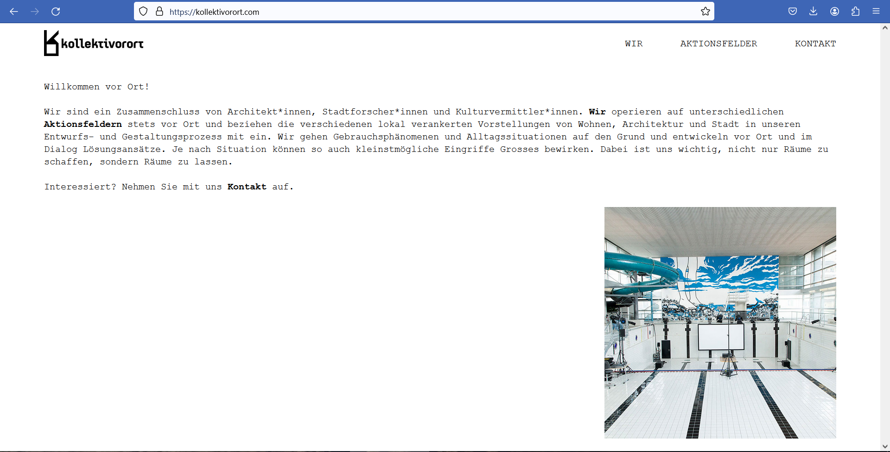

# Project Name
> kollektivorort

## Table of contents
* [General info](#general-info)
* [Screenshots](#screenshots)
* [Technologies](#technologies)
* [Status](#status)
* [Inspiration](#inspiration)
* [Contact](#contact)

## General info
It is a website of an active association of architects, urban researchers and cultural mediators. I developed the code (using html, css and js), collaborated with the design and issues related to hosting and launching the site.

## Screenshots

## Technologies
* HTML - 5
* CSS - 3
* JavaScript - ES6

## Status
The site is already available to visitors, but it is still a work in progress, whether in relation to content, or site design, or even the use of web technologies, with tests and different options for each version.

## Inspiration
The website shows the result of years of work of this Swiss group, which always operates on site in different fields of action and includes the various local ideas of housing, architecture and the city in their design process. They get to the bottom of usage phenomena and everyday situations and develop solutions on site and always in dialogue, knowing that depending on the situation, even the smallest interventions can have a big impact. 

The construction of the website, in a participative and collaborative way between me and the group (Angelika Juppien, Andréa Nascimento and Richard Zemp) happened during 2002 with many conversations, video calls and exchange of emails and files, until we get this version launched in early 2023.

The complete site, including large files for download not included in the git version, can be accessed at: https://kollektivorort.com/

## Contact
Created by [@stankuns](https://www.fernando.arq.br/) - feel free to contact me!